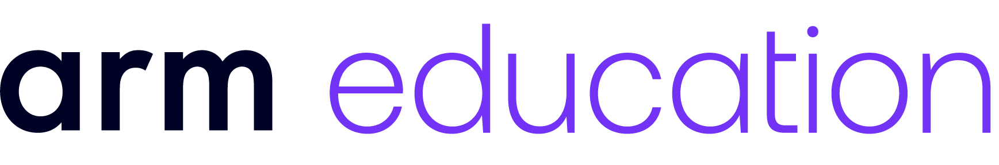

# Advanced AI

This course provides a hands-on introduction to *extreme model quantization*, *hardware-aware optimization*, and *on-device deployment* for generative AI models. You'll explore advanced techniques to reduce model size, accelerate inference, and deploy compact LLMs on edge devices like Android smartphones.

## Audience

This course is designed for industry ML engineers who want practical, ready-to-adapt examples for integrating advanced optimization techniques into their own applications. It is also well-suited for ML researchers interested in exploring and experimenting with cutting‑edge methods for model compression and performance optimization.

Learners should be comfortable with intermediate Python and PyTorch, including working with modern network architectures such as transformers and general training pipelines. Those who want to build or refresh these fundamentals can first complete introductory and intermediate material such as the [Intro to AI](https://www.edx.org/learn/computer-science/arm-education-introduction-to-ai) or [Optimizing Generative AI on Arm](https://www.edx.org/learn/computer-science/arm-education-ai-on-arm) course.


## Labs Overview

### Lab 1: **Extreme Quantization**
Train a language model and progressively quantize it from FP32 to 8-bit, 4-bit, 2-bit, and 1-bit precision. Implement and evaluate **Quantization-Aware Training (QAT)** to mitigate accuracy degradation in ultra-low-bit models.

### Lab 2: **Hardware–Software Model Co-Design**
Wrap all `nn.Linear` layers with a custom `QLinear` module and explore **layerwise post-training quantization**. Search for the optimal bit-width configuration to maximize efficiency while maintaining model fidelity in a software-hardware co-design process.

### Lab 3: **Running & Quantizing Models on Android**
Use [`llama.cpp`](https://github.com/ggerganov/llama.cpp) to quantize and deploy LLaMA-style LLMs on Android. Learn how to benchmark and run models *offline*, directly on your mobile hardware.

---

## Getting Started

### Requirements

This course runs cross‑platform and has been validated on an NVIDIA DGX Spark; for training the models, we recommend using an accelerated backend such as a GPU. It is expected that you are familiar with configuring software across different operating systems, and you may need to install additional packages depending on your environment.

This repository uses a unified `requirements.txt` and Git LFS to manage dependencies and large pretrained models.

### 1️. Clone the Repository and Download Model Weights

```bash
# Install Git LFS if needed
sudo apt install git-lfs              # or: brew install git-LFS
git lfs install

# Clone the repo and pull large files
git clone git@github.com:arm-university/Advanced-AI-pt-2.git
cd Advanced-AI-pt-2
git lfs pull
```

### 2️. Set Up the Python Environment

```bash
python3 -m venv venv
source venv/bin/activate
pip install -r requirements.txt
```

### 3️. Run the Labs

```bash
jupyter lab
```

Open:

- `lab1.ipynb` for **Extreme Quantization**
- `lab2.ipynb` for **Hardware–Software Co-Design**
- Follow `lab3.md` for **Android deployment** with `llama.cpp`

---

## Repository Structure

```
./Advanced-AI-pt-2
├── assets
├── lab1.ipynb
├── lab2.ipynb
├── lab3.md
├── LICENSE.md
├── README.md
├── requirements.txt
└── src
```

---

## Android Deployment Notes

To complete **Lab 3**, make sure the following are installed:

- Android Studio (Hedgehog or later)
- Android NDK + ADB
- A physical Android 10+ device with ≥6GB RAM

> Windows users: use **WSL 2** with Ubuntu 22.04 for full compatibility with build tools.

---

## Learning Outcomes

- Understand bit-width trade-offs (accuracy vs. compression)
- Apply QAT to recover performance in quantized models
- Perform per-layer hardware-aware optimization
- Deploy and benchmark local LLMs on Android devices

---

## License
You are free to fork or clone this material. See `LICENSE.md` for the complete license.

## Inclusive Language Commitment
Arm is committed to making the language we use inclusive, meaningful, and respectful. Our goal is to remove and replace non-inclusive language from our vocabulary to reflect our values and represent our global ecosystem.
 
Arm is working actively with our partners, standards bodies, and the wider ecosystem to adopt a consistent approach to the use of inclusive language and to eradicate and replace offensive terms. We recognise that this will take time. This course may contain references to non-inclusive language; it will be updated with newer terms as those terms are agreed and ratified with the wider community. 
 
Contact us at education@arm.com with questions or comments about this course. You can also report non-inclusive and offensive terminology usage in Arm content at terms@arm.com.

---
